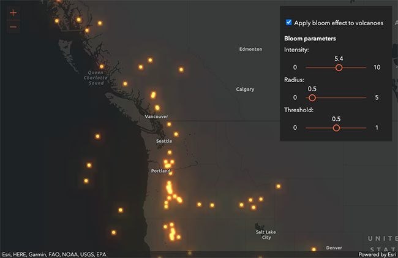

<!-- .slide: data-background="../node_modules/esri-reveal.js-templates/img/2021/dev-summit/bg-1.png" data-background-size="cover" -->
<!-- Presenter: Franco -->

# Building Your Own Widget <br />with the ArcGIS JSAPI

## Matt Driscoll – [@driskull](https://twitter.com/driskull)

## JC Franco – [@arfncode](https://twitter.com/arfncode)

---

# Agenda

- Set up dev environment
- Widget fundamentals
- Develop
  - `LayerFX` Class
  - Simple Widget
  - `LayerFX` Widget
- Additional improvements

---

<!-- .slide: data-background="../node_modules/esri-reveal.js-templates/img/2021/dev-summit/bg-4.png" data-background-size="cover" -->

# Setting up the Dev Environment

---

# Developer environment

<!-- background: section/content will tie into widget dev -->
<!-- background: including TS in all steps because it's needed for widget dev -->

JS API + TypeScript

---

# [TypeScript](http://www.typescriptlang.org/)

---

# Typed JavaScript

```ts
interface Person {
  name: string;
  age: number;
}

const person: Person = { name: "Franco", age: 35 };

person.age = "24"; // Type '"24"' is not assignable to type 'number'
person.height = 5.11; // Property 'height' does not exist on type 'Person'

function greet(person: Person): void {
  console.log("Hello " + person.name + "!");
}

greet(person); // Hello Franco!
```

---

# Modern JavaScript

```ts
// let and const
let canChange = 5;
const cannotChange = 5;

// fat arrow functions
const logName = (person) => console.log(person.name);

// template strings
const greeting = `Hello, my name is ${person.name} and I am ${person.age} years old.`;

// destructuring
const [{ name, age }] = people;

// property shorthand
const shorthand = { person };
```

---

# IDE Support

- Visual Studio Code
- WebStorm
- Sublime Text
- and more!

---

<!-- .slide: data-background="../node_modules/esri-reveal.js-templates/img/2021/dev-summit/bg-3.png" data-background-size="cover" -->

# Demo: [Dev Environment](../demos/1-setup/)

- [Typescript setup](https://developers.arcgis.com/javascript/latest/typescript-setup/)

---

<!-- .slide: data-background="../node_modules/esri-reveal.js-templates/img/2021/dev-summit/bg-3.png" data-background-size="cover" -->

# Demo Recap: Dev Environment

- Install of TypeScript + JS API typings
- Built simple mapping application

---

<!-- .slide: data-background="../node_modules/esri-reveal.js-templates/img/2021/dev-summit/bg-4.png" data-background-size="cover" -->

<!-- Presenter: Matt -->

# Creating a Class

---

# `esri/core/Accessor`

- JavaScript API foundation <!-- .element: class="fragment" data-fragment-index="0" -->
- Consistent developer experience <!-- .element: class="fragment" data-fragment-index="1" -->

```ts
// unified object constructor
const me = new Person({ name: "Franco", age: 33 });

// watch for changes to `age`
me.watch("age", () => console.log("happy birthday!"));

// watch for changes to `age`
me.watch("age", () => console.log("happy birthday!"));
```

<!-- .element: class="fragment" data-fragment-index="1" -->

---

# `esri/core/Accessor`

- Unified object constructor

```ts
class Person extends Accessor {
  @property()
  name: string;

  @property()
  age: number;
}

const self = new Person({ name: "Franco", age: 33 });

console.log(self.name, self.age); // Franco, 33
```

---

# `esri/core/Accessor`

- Watch properties

```ts
const self = new Person({ name: "Franco", age: 33 });

// watch for changes to `age`
self.watch("age", () => console.log("happy birthday!"));
```

---

# `esri/core/Accessor`

- Alias properties

```ts
class Person extends Accessor {
  // ...

  @property({ aliasOf: "age" })
  yearsAlive: number;
}

const self = new Person({ name: "Franco", age: 33 });

// watch for changes to `age`
console.log(self.yearsAlive); // 33
```

---

# `esri/core/Accessor`

- Autocast™ (easy class instantiation)

```ts
class House extends Accessor {
  @property({ type: Person })
  owner: Person;
}

const house = new House({ owner: { name: "Franco", age: 33 } });

// house.owner is an instance of Person
console.log(house.owner.yearsAlive); // 33
```

---

<!-- .slide: data-background="../node_modules/esri-reveal.js-templates/img/2021/dev-summit/bg-3.png" data-background-size="cover" -->

# Demo: Background

Inspired by [Intro to layer effect](https://developers.arcgis.com/javascript/latest/sample-code/intro-effect-layer/) sample

<a target="_blank" href="https://developers.arcgis.com/javascript/latest/sample-code/intro-effect-layer/"></a>

---

# Demo: Background

Requirements

- Allows configuring layer effects
- Updating effects should be applied to the layer

---

<!-- .slide: data-background="../node_modules/esri-reveal.js-templates/img/2021/dev-summit/bg-3.png" data-background-size="cover" -->

# Demo: Background

Exploring the Layer Effects API

[`FeatureLayer#effect`](https://developers.arcgis.com/javascript/latest/api-reference/esri-layers-FeatureLayer.html#effect)
[`FeatureEffect`](https://developers.arcgis.com/javascript/latest/api-reference/esri-views-layers-support-FeatureEffect.html#Effect)
[CSS filter](https://developer.mozilla.org/en-US/docs/Web/CSS/filter)

---

<!-- .slide: data-background="../node_modules/esri-reveal.js-templates/img/2021/dev-summit/bg-3.png" data-background-size="cover" -->

# Demo: [`LayerFX` Class API](../demos/2-custom-class/)

```ts
interface LayerFX extends Accessor {
  layer: Layer;
  readonly effects: Collection<LayerEffect>;
  readonly statements: string;
}

interface LayerEffect {
  enabled: boolean;
  id: "bloom" | "blur" | ... | "sepia";
  values: number[];
  readonly valueTypes: { unit: string; ... }[];
  readonly statement: string;
}
```

---

<!-- .slide: data-background="../node_modules/esri-reveal.js-templates/img/2021/dev-summit/bg-3.png" data-background-size="cover" -->

# Demo Recap: `LayerFX` Class

- Implemented `LayerFX`
  - Extended `esri/core/Accessor`
  - Created properties with `@property`
  - Typed constructor arguments
  - Created methods

---

<!-- .slide: data-background="../node_modules/esri-reveal.js-templates/img/2021/dev-summit/bg-4.png" data-background-size="cover" -->

# Writing a Widget

---

# What are widgets?

- Component of UI
- Perform a function
- Interactive
- Stateful

---

# Why use widgets?

- Reusable
- Modular
- Help build more complex apps

---

# How to create a widget?

- Extend `esri/Widgets/Widget`

---

# `esri/widgets/Widget`

- Base widget class (View)
- Extends `esri/core/Accessor`
  - Properties
  - Watching properties
- Lifecycle

---

# Lifecycle

- `constructor`
- `postInitialize`
- `render`
  - `when()` after first render
- `destroy`

---

# `render`

- Defines UI
- Reacts to state changes
- Uses JSX (VDOM)
- <!-- .element: class="fragment" data-fragment-index="1" -->Will automatically re-render on property updates ✨new✨

---

# Let's create a simple widget

Simple widget view that renders the `enabled` state of a button

```ts
interface SimpleWidget extends Widget {
  enabled: boolean;
}
```

---

<!-- .slide: data-background="../node_modules/esri-reveal.js-templates/img/2021/dev-summit/bg-3.png" data-background-size="cover" -->

# Demo: [`SimpleWidget`](../demos/3-simple-view/)

Develop a simple widget


---

# Demo Recap: `SimpleWidget`

- Extended `esri/widgets/Widget`
- Implemented `render()`
- Added a renderable `property()`
- Added `onclick` event
- Added CSS Object + [BEM Methodology](http://getbem.com/)
- Toggled property with event to re-render

---

<!-- Presenter: Franco -->

<!-- .slide: data-background="../node_modules/esri-reveal.js-templates/img/2021/dev-summit/bg-4.png" data-background-size="cover" -->

# Improving Our Widget

---

# Architecture

- Views + ViewModels
  - Separation of concerns
  - UI replacement
  - Easier integration

---

# Views

- `SimpleWidget` example
- Extend `esri/widgets/Widget`
- Rely on ViewModel
- Focus on UI

---

# ViewModels

- `LayerFX` class example
- Extend `esri/core/Accessor`
- Provide APIs to support View
- Focus on business logic

---

# View + ViewModel in action

<!-- todo: maybe create graphic for this -->

- View renders the state of the VM
  - Looks at properties on VM and renders accordingly
- User interacts with View (property/method)<!-- .element: class="fragment" data-fragment-index="1" -->
  - Causes a change on VM or View
- View updates <!-- .element: class="fragment" data-fragment-index="2" -->
  - Renders again due to changes on VM

---

# Let's create `LayerFX` Widget

[](../demos/completed/)

---

# Demo VM Interface

```ts
interface LayerFXViewModel extends Accessor {
  layer: Layer;
  readonly effects: Collection<LayerEffect>;
  readonly state: string;
  readonly statements: string;
}
```

---

# Demo: View Interface

```ts
interface LayerFX extends Widget {
  layer: EffectLayer;
  viewModel: LayerFXViewModel;
}
```

---

<!-- .slide: data-background="../node_modules/esri-reveal.js-templates/img/2021/dev-summit/bg-3.png" data-background-size="cover" -->

# Demo: [Updated View](../demos/4-custom-widget/)

- Use `LayerFX` class as `LayerFXViewModel`
  - Add a state property
- Create `LayerFX` view
  - Alias VM properties
  - Create BEM classes object
  - Render sections

<!--- mention BEM -->

---

# Demo Recap: Update View

- Paired View and ViewModel
- Rendered properties from ViewModel
- Wired up interactivity
- Learned to apply styles
- Dynamically rendered UI based on a property value change

---

<!-- .slide: data-background="../node_modules/esri-reveal.js-templates/img/2021/dev-summit/bg-4.png" data-background-size="cover" -->

---

<!-- .slide: data-background="../node_modules/esri-reveal.js-templates/img/2021/dev-summit/bg-4.png" data-background-size="cover" -->

# Additional improvements

Supporting other languages

- Message bundles (translations: `t9n`)
  - loader
  - `@messageBundle`

---

# Demo: [Supporting other locales](../demos/5-custom-widget-with-t9n/)

---

<!-- .slide: data-background="../node_modules/esri-reveal.js-templates/img/2021/dev-summit/bg-4.png" data-background-size="cover" -->

# Final Recap

- Set up dev environment
- Wrote `LayerFX` class
- Developed a `LayerFX` Widget
- Enhanced `LayerFX` Widget

---

## Additional Resources

- [Implementing Accessor](https://developers.arcgis.com/javascript/latest/guide/implementing-accessor/index.html)
- [Setting up TypeScript](https://developers.arcgis.com/javascript/latest/guide/typescript-setup/index.html)
- [Widget Development](https://developers.arcgis.com/javascript/latest/guide/custom-widget/index.html)
- [Styling](https://developers.arcgis.com/javascript/latest/guide/styling/)
- [ArcGIS API for JavaScript - next](https://github.com/Esri/feedback-js-api-next)
- [Widget Patterns](https://github.com/jcfranco/4x-widget-patterns)

---

## You might also be interested in...

- Customizing the ArcGIS API for JavaScript Widgets
- ArcGIS API for JavaScript: Getting Started with Web Development
- ArcGIS API for JavaScript: Programming Patterns and API Fundamentals
- Accessible Web Mapping Apps: ARIA, WCAG and 508 Compliance

---

# Questions? 🤔

> Where can I find the slides/source?

[bit.ly/buildwidgetsds21](http://bit.ly/buildwidgetsds21)

> Where can I submit a question?

[bit.ly/askjsapi](http://bit.ly/askjsapi)

---

<section data-markdown data-background="../node_modules/esri-reveal.js-templates/img/2021/dev-summit/bg-5.png">


