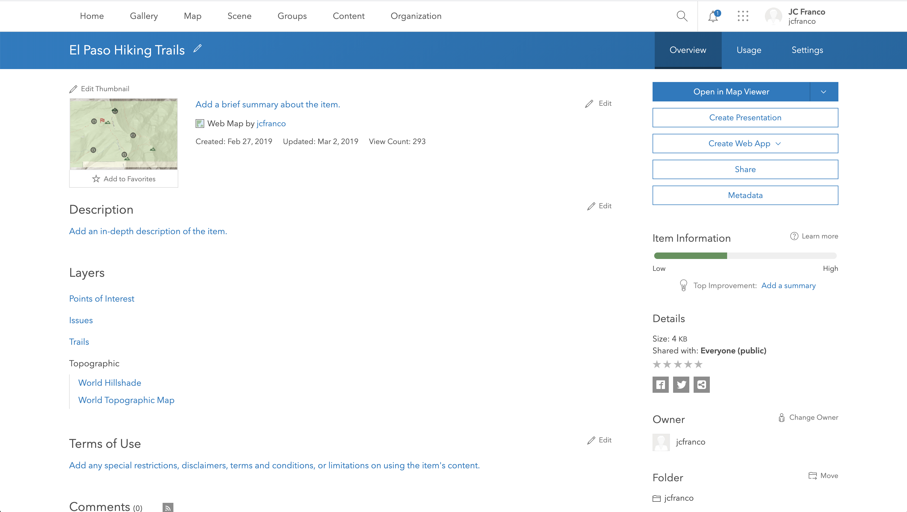
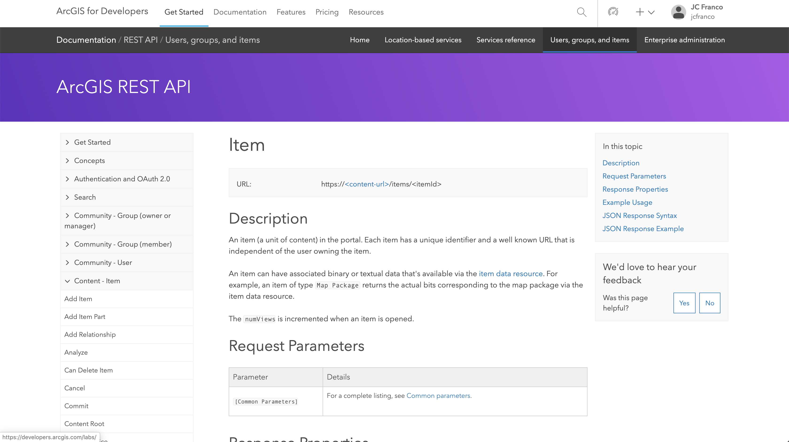
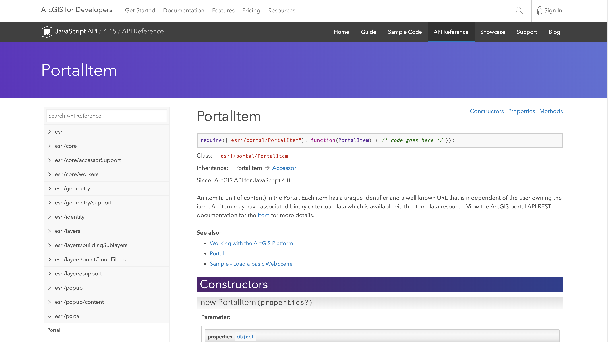
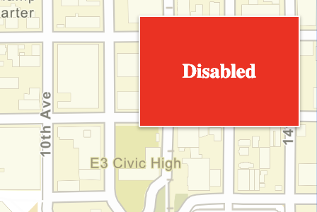
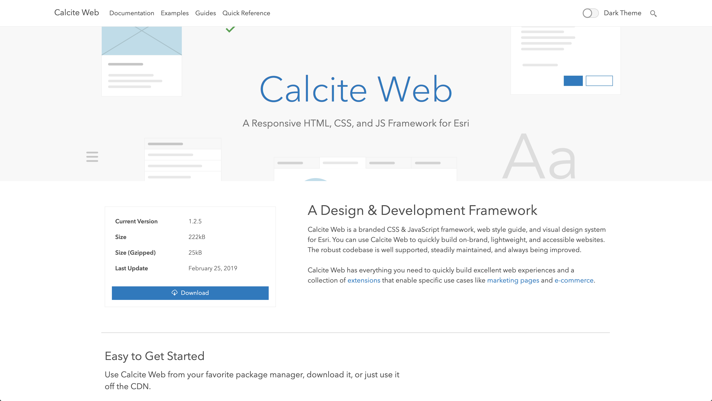

<!-- .slide: data-background="../node_modules/esri-reveal.js-templates/img/2021/devsummit/bg-1.png" data-background-size="cover" -->
<!-- Presenter: Franco -->

# Building Your Own Widget <br />with the ArcGIS JSAPI

## Matt Driscoll – [@driskull](https://twitter.com/driskull)

## JC Franco – [@arfncode](https://twitter.com/arfncode)

---

# Agenda

- Set up dev environment
- Develop
  - `ItemScore` Class
  - Simple Widget
  - `ItemScore` Widget

---

<!-- .slide: data-background="../node_modules/esri-reveal.js-templates/img/2021/devsummit/bg-4.png" data-background-size="cover" -->

# Setting up the Dev Environment

---

# Developer environment

<!-- background: section/content will tie into widget dev -->
<!-- background: including TS in all steps because it's needed for widget dev -->

JS API + TypeScript

---

# [TypeScript](http://www.typescriptlang.org/)

---

# Typed JavaScript

```ts
interface Person {
  name: string;
  age: number;
}

const person: Person = { name: "Franco", age: 35 };

person.age = "24"; // Type '"24"' is not assignable to type 'number'
person.height = 5.11; // Property 'height' does not exist on type 'Person'

function greet(person: Person): void {
  console.log("Hello " + person.name + "!");
}

greet(person); // Hello Franco!
```

---

# JS of the future, now

```ts
// let and const
let canChange = 5;
const cannotChange = 5;

// fat arrow functions
const logName = (person) => console.log(person.name);

// template strings
const greeting = `Hello, my name is ${person.name} and I am ${person.age} years old.`;

// destructuring
const [{ name, age }] = people;

// property shorthand
const shorthand = { person };
```

---

# IDE Support

- Visual Studio Code
- WebStorm
- Sublime Text
- and more!

---

<!-- .slide: data-background="../node_modules/esri-reveal.js-templates/img/2021/devsummit/bg-3.png" data-background-size="cover" -->

# Demo: [Dev Environment](../demos/1-setup/)

- Install TypeScript + JS API

---

<!-- .slide: data-background="../node_modules/esri-reveal.js-templates/img/2021/devsummit/bg-3.png" data-background-size="cover" -->

# Demo Recap: Dev Environment

- Installed TypeScript + JS API typings
- Built simple mapping application

---

<!-- .slide: data-background="../node_modules/esri-reveal.js-templates/img/2021/devsummit/bg-4.png" data-background-size="cover" -->

<!-- Presenter: Matt -->

# Creating a Class

---

# `esri/core/Accessor`

- JavaScript API foundation <!-- .element: class="fragment" data-fragment-index="0" -->
- Consistent developer experience <!-- .element: class="fragment" data-fragment-index="1" -->

```ts
// unified object constructor
const me = new Person({ name: "Franco", age: 33 });

// watch for changes to `age`
me.watch("age", singHappyBirthday);
```

<!-- .element: class="fragment" data-fragment-index="1" -->

---

<!-- .slide: data-background="../node_modules/esri-reveal.js-templates/img/2021/devsummit/bg-3.png" data-background-size="cover" -->

# Demo: Background

Inspired by ArcGIS Item Page

<a target="_blank" href="https://jsapi.maps.arcgis.com/home/item.html?id=f5a89635bb394f7da2f9c82cdd73e459" ></a>

---

# Demo: Background

Requirements

- Need to load an item
- Allow editing item properties
- Highlight the item's score
- Provide suggestions to improve item's score
- Save an item

---

<!-- .slide: data-background="../node_modules/esri-reveal.js-templates/img/2021/devsummit/bg-3.png" data-background-size="cover" -->

# Demo: Background

Exploring the Item structure

<a target="_blank" href="https://developers.arcgis.com/rest/users-groups-and-items/item.htm" ></a>

[ArcGIS REST API - Item](https://developers.arcgis.com/rest/users-groups-and-items/item.htm)

---

<!-- .slide: data-background="../node_modules/esri-reveal.js-templates/img/2021/devsummit/bg-3.png" data-background-size="cover" -->

# Demo: Background

Exploring the JS API `PortalItem` class

<a target="_blank" href="https://developers.arcgis.com/javascript/latest/api-reference/esri-portal-PortalItem.html"></a>

[ArcGIS JavaScript API - PortalItem](https://developers.arcgis.com/javascript/latest/api-reference/esri-portal-PortalItem.html)

---

<!-- .slide: data-background="../node_modules/esri-reveal.js-templates/img/2021/devsummit/bg-3.png" data-background-size="cover" -->

# Demo: [`ItemScore` Class API](../demos/2-custom-class/)

```ts
interface ItemScore extends Accessor {
  portal: Portal;
  itemId: string;
  readonly suggestions: { name: string; type: "add" | "enhance" }[];

  title: string;
  summary: string;
  description: string;
  tags: string;
  termsOfUse: string;
  thumbnail: string;

  load(): Promise<void>;
  save(): Promise<void>;
}
```

---

<!-- .slide: data-background="../node_modules/esri-reveal.js-templates/img/2021/devsummit/bg-3.png" data-background-size="cover" -->

# Demo Recap: `ItemScore` Class

- Implemented `ItemScore`
  - Extended `esri/core/Accessor`
  - Created properties with `@property`
  - Typed constructor arguments
  - Created public + private methods

---

<!-- .slide: data-background="../node_modules/esri-reveal.js-templates/img/2021/devsummit/bg-4.png" data-background-size="cover" -->

# Writing a Widget

---

# What are widgets?

- Component of UI
- Perform a function
- Interactive
- Stateful

---

# Why use widgets?

- Reusable
- Modular
- Help build more complex apps

---

# How to create a widget?

- Extend `esri/Widgets/Widget`

---

# `esri/widgets/Widget`

- Base widget class (View)
- Extends `esri/core/Accessor`
  - Properties
  - Watching properties
- Lifecycle

---

# Lifecycle

- `constructor`
- `postInitialize`
- `render`
- `destroy`

---

# `render`

- Defines UI
- Reacts to state changes
- Uses JSX (VDOM)

---

# Let's create a simple widget

Simple widget view that renders the `enabled` state of a button

```ts
interface SimpleWidget extends Widget {
  enabled: boolean;
}
```

---

<!-- .slide: data-background="../node_modules/esri-reveal.js-templates/img/2021/devsummit/bg-3.png" data-background-size="cover" -->

# Demo: [`SimpleWidget`](../demos/3-simple-view/)

Develop a simple widget



---

# Demo Recap: `SimpleWidget`

- Extended `esri/widgets/Widget`
- Implemented `render()`
- Added a `renderable()` property
- Added `onclick` event
- Added CSS Object + [BEM Methodology](http://getbem.com/)
- Toggled property with event to re-render

---

<!-- Presenter: Franco -->

<!-- .slide: data-background="../node_modules/esri-reveal.js-templates/img/2021/devsummit/bg-4.png" data-background-size="cover" -->

# Improving Our Widget

---

# Architecture

- Views + ViewModels
  - Separation of concerns
  - UI replacement
  - Easier integration

---

# Views

- `SimpleWidget` example
- Extend `esri/widgets/Widget`
- Rely on ViewModel
- Focus on UI

---

# ViewModels

- `ItemScore` class example
- Extend `esri/core/Accessor`
- Provide APIs to support View
- Focus on business logic

---

# View + ViewModel in action

<!-- todo: maybe create graphic for this -->

- View renders the state of the VM
  - Looks at properties on VM and renders accordingly
- User interacts with View (property/method)<!-- .element: class="fragment" data-fragment-index="1" -->
  - Causes a change on VM or View
- View updates <!-- .element: class="fragment" data-fragment-index="2" -->
  - Renders again due to changes on VM

---

# Let's create `ItemScore` Widget

[](../demos/completed/)

---

# Demo VM Interface

```ts
interface ItemScore extends Accessor {
  // ✨ new ✨
  state: "idle" | "loading" | "ready";
}
```

---

# Demo: View Interface

```ts
interface ItemScore extends Widget {
  portal: Portal;
  itemId: string;
}
```

---

<!-- .slide: data-background="../node_modules/esri-reveal.js-templates/img/2021/devsummit/bg-3.png" data-background-size="cover" -->

# Demo: Styling



[Calcite Web](http://esri.github.io/calcite-web/)

---

<!-- .slide: data-background="../node_modules/esri-reveal.js-templates/img/2021/devsummit/bg-3.png" data-background-size="cover" -->

# Demo: [Updated View](../demos/4-custom-widget/)

- Use `ItemScore` class as `ItemScoreViewModel`
  - Add a state property
- Create `ItemScore` view
  - Alias VM properties
  - Create BEM classes object
  - Render sections

<!--- mention BEM -->

---

# Demo Recap: Update View

- Paired View and ViewModel
- Rendered properties from ViewModel
- Wired up interactivity
- Learned to apply styles
- Dynamically rendered UI based on a property value change

---

<!-- .slide: data-background="../node_modules/esri-reveal.js-templates/img/2021/devsummit/bg-4.png" data-background-size="cover" -->

# Final Recap

- Set up dev environment
- Wrote `ItemScore` class
- Developed a `ItemScore` Widget

---

## Additional Resources

- [Implementing Accessor](https://developers.arcgis.com/javascript/latest/guide/implementing-accessor/index.html)
- [Setting up TypeScript](https://developers.arcgis.com/javascript/latest/guide/typescript-setup/index.html)
- [Widget Development](https://developers.arcgis.com/javascript/latest/guide/custom-widget/index.html)
- [Styling](https://developers.arcgis.com/javascript/latest/guide/styling/)
- [ArcGIS API for JavaScript - next](https://github.com/Esri/feedback-js-api-next)
- [Widget Patterns](https://github.com/jcfranco/4x-widget-patterns)

---

## You might also be interested in...

- ArcGIS API for JavaScript: Getting Started with Web Development
- ArcGIS API for JavaScript: 2D Visualization
- ArcGIS API for JavaScript: Using TypeScript
- ArcGIS API for JavaScript: Tips and Tricks for Developing and Debugging Apps
- Building Light-Weight Map Authoring Web Apps
- Customizing the ArcGIS API for JavaScript Widgets

---

# Questions? 🤔

> Where can I find the slides/source?

[bit.ly/buildwidgetsds20](http://bit.ly/buildwidgetsds20)

> Where can I submit a question?

[bit.ly/askjsapi](http://bit.ly/askjsapi)

---


<!-- .slide: data-background="../node_modules/esri-reveal.js-templates/img/2021/devsummit/bg-esri.png" data-background-size="cover" -->
